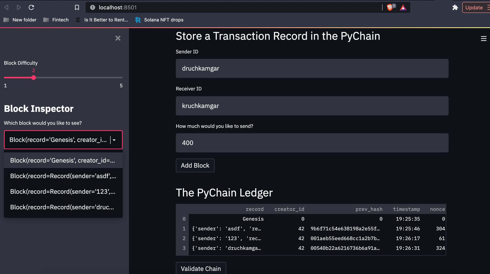
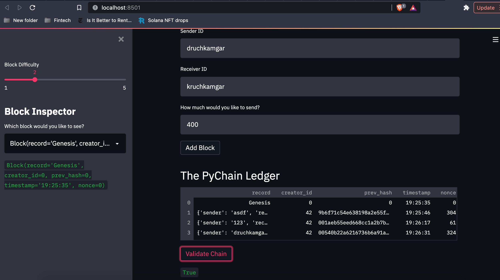

# Challenge_18
## Purpose
To modify an existing blockchain that accepts user inputs using streamlit to create new blocks, add them to a chain and validate the chain

## Screenshot of Block Content

## Screenshot of Validation
