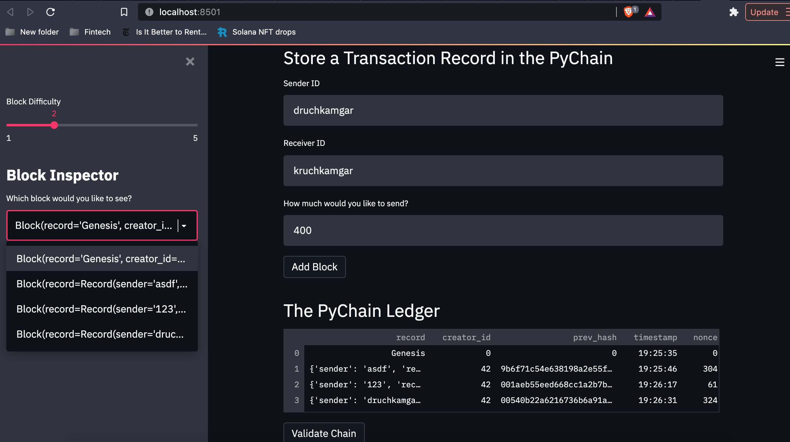
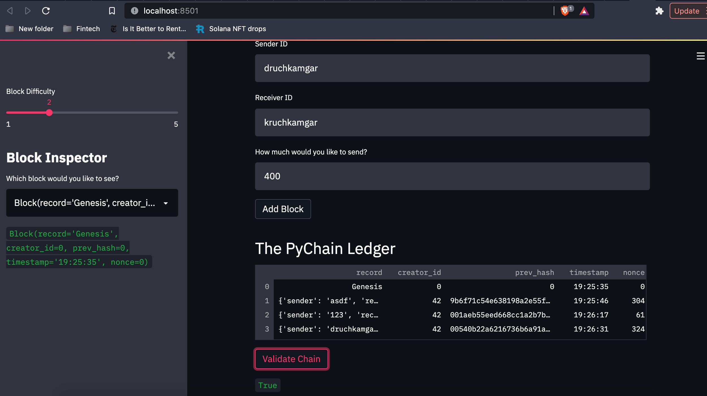

# Challenge_18
## Purpose
Modify an existing blockchain to accept user inputs to create blocks, add them to a chain, and validate the chain. 

# Screenshot of Block Content

# Screenshot of Validation
